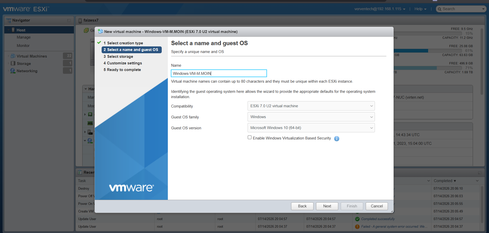

# VMware ESXi Virtualization Lab

## 📌 Overview

This repository documents my hands-on experience with VMware ESXi, where I created and configured virtual machines from scratch. The project includes a step-by-step walkthrough of virtual machine creation, hardware configuration, operating system installation, and verification using screenshots and detailed explanations.

This lab was completed as part of my DevOps learning journey to strengthen my understanding of virtualization technologies and virtual infrastructure management.

---

## 🎯 Objectives

- Learn VMware ESXi virtualization
- Create virtual machines from scratch
- Configure virtual hardware
- Install operating systems
- Understand virtual networking and storage
- Document the complete deployment process

---

## 🛠️ Technologies Used

- VMware ESXi
- Virtual Machines (VM)
- Ubuntu Linux
- Windows 10
- ISO Images
- Virtual Storage
- Virtual Networking

---

## 📚 Project Workflow

1. Login to VMware ESXi
2. Create a New Virtual Machine
3. Select Guest Operating System
4. Configure CPU and Memory
5. Configure Virtual Storage
6. Configure Network Adapter
7. Mount Operating System ISO
8. Install Operating System
9. Verify Successful Installation

---

## 📸 Screenshots
## Step 1: Select Creation Type

### 🎯 Objective

To begin the virtual machine creation process by selecting the appropriate deployment option in VMware ESXi.

### 📝 Description

From the **New Virtual Machine** wizard, **Create a new virtual machine** was selected. This option is used to create a new virtual machine from scratch, allowing complete customization of the virtual hardware such as CPU, memory, storage, and networking before installing the operating system.

### 📷 Screenshot

## Step 2: Configure Virtual Machine Name and Guest Operating System

### 🎯 Objective

Configure the virtual machine by assigning a unique name and selecting the appropriate guest operating system to ensure VMware ESXi applies the correct default settings.

### 📝 Description

In this step, a unique name was assigned to the virtual machine. The guest operating system family was set to **Windows**, and the operating system version was selected as **Microsoft Windows 10 (64-bit)**. Selecting the correct operating system ensures compatibility and allows VMware ESXi to apply optimized virtual hardware settings for the VM.

### 📷 Screenshot

---

---

## 💡 Skills Demonstrated

- VMware ESXi Administration
- Virtual Machine Deployment
- Virtual Hardware Configuration
- Operating System Installation
- Virtual Networking
- Virtual Storage Management
- Infrastructure Documentation
- DevOps Fundamentals

---

## 🚀 Future Improvements

- Deploy multiple virtual machines
- Configure SSH access
- Install Docker
- Host web applications
- Configure Apache/Nginx
- Create VM Snapshots
- Explore Kubernetes on VMware

---

## 👨‍💻 Author

**Moin Rafi**

Aspiring DevOps Engineer passionate about Linux, Cloud Computing, Virtualization, and Infrastructure Automation.

GitHub: https://github.com/MoinRafi11
