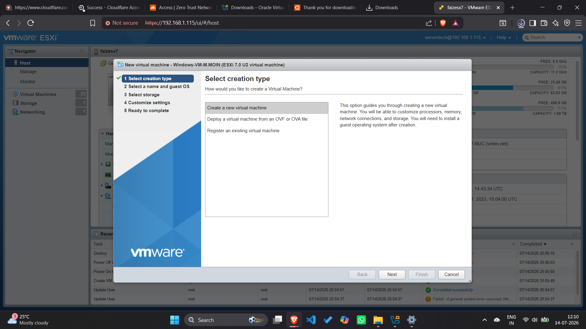

# VMware ESXi Virtualization Lab

## 📌 Overview

This repository documents my hands-on experience with VMware ESXi, where I created and configured virtual machines from scratch. The project includes a step-by-step walkthrough of virtual machine creation, hardware configuration, operating system installation, and verification using screenshots and detailed explanations.

This lab was completed as part of my DevOps learning journey to strengthen my understanding of virtualization technologies and virtual infrastructure management.

---

## 🎯 Objectives

- Learn VMware ESXi virtualization
- Create virtual machines from scratch
- Configure virtual hardware
- Install operating systems
- Understand virtual networking and storage
- Document the complete deployment process

---

## 🛠️ Technologies Used

- VMware ESXi
- Virtual Machines (VM)
- Ubuntu Linux
- Windows 10
- ISO Images
- Virtual Storage
- Virtual Networking

---

## 📚 Project Workflow

## 📘 Project Workflow

- Introduction
- Prerequisites
- Lab Environment
- Step 1: Select Creation Type
- Step 2: Select Name and Guest OS
- Step 3: Select Storage
- Step 4: Customize Virtual Hardware
- Step 5: Review Configuration
- Step 6: Choose Installation Type
- Step 7: Select Installation Drive
- Step 8: Installing Windows
- Step 9: Initial Windows Setup
- Step 10: Verifying Successful Installation
- Conclusion

---

## 📸 Screenshots
## Step 1: Select Creation Type

### 🎯 Objective

To begin the virtual machine creation process by selecting the appropriate deployment option in VMware ESXi.

### 📝 Description

From the **New Virtual Machine** wizard, **Create a new virtual machine** was selected. This option is used to create a new virtual machine from scratch, allowing complete customization of the virtual hardware such as CPU, memory, storage, and networking before installing the operating system.

### 📷 Screenshot

----------------------------------------

## 📘 Detailed Installation Guide

The complete VMware ESXi installation walkthrough, including all screenshots and detailed explanations, is available in **VMware_ESXi_Lab_Guide.pdf**.

-----------------------------------------

## 💡 Skills Demonstrated

- VMware ESXi Administration
- Virtual Machine Deployment
- Virtual Hardware Configuration
- Operating System Installation
- Virtual Networking
- Virtual Storage Management
- Infrastructure Documentation
- DevOps Fundamentals

---

## 🚀 Future Improvements

- Deploy multiple virtual machines
- Configure SSH access
- Install Docker
- Host web applications
- Configure Apache/Nginx
- Create VM Snapshots
- Explore Kubernetes on VMware

---

## 👨‍💻 Author

**Moin Rafi**

Aspiring DevOps Engineer passionate about Linux, Cloud Computing, Virtualization, and Infrastructure Automation.

GitHub: https://github.com/MoinRafi11
